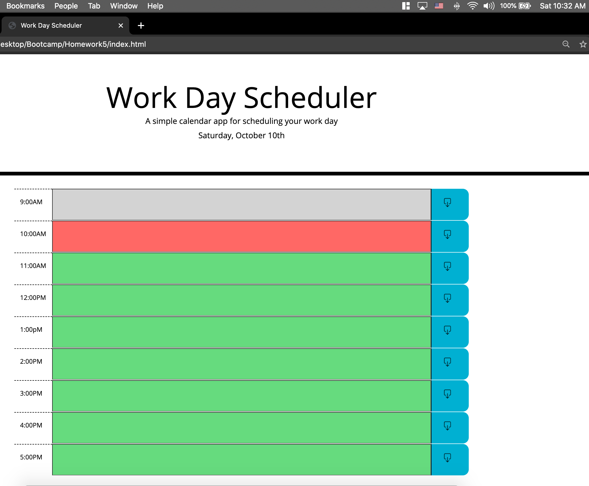

# Homework5
Work day hourly planner

In this simple daily work planner app.  The user can plan their day by typing into an hour field and clicking the save button.  Local storage will hold that information until it is cleared out and re saved.  The planner also shows you current hour,  hours that have passed, and hours that havent happened yet by color coding them in either red, grey, and green respectively.  At the top of the app the current date and time is provided.  

## ScreenShots

## Links
Repository
[GitHub](http://github.com/rffrye/Homework5)

Deployed Page 
[GitHub](https://rffrye.github.io/Homework5/)

## Technologies used

* HTML
* Jquery 
* Javascript
* Moment.JS
